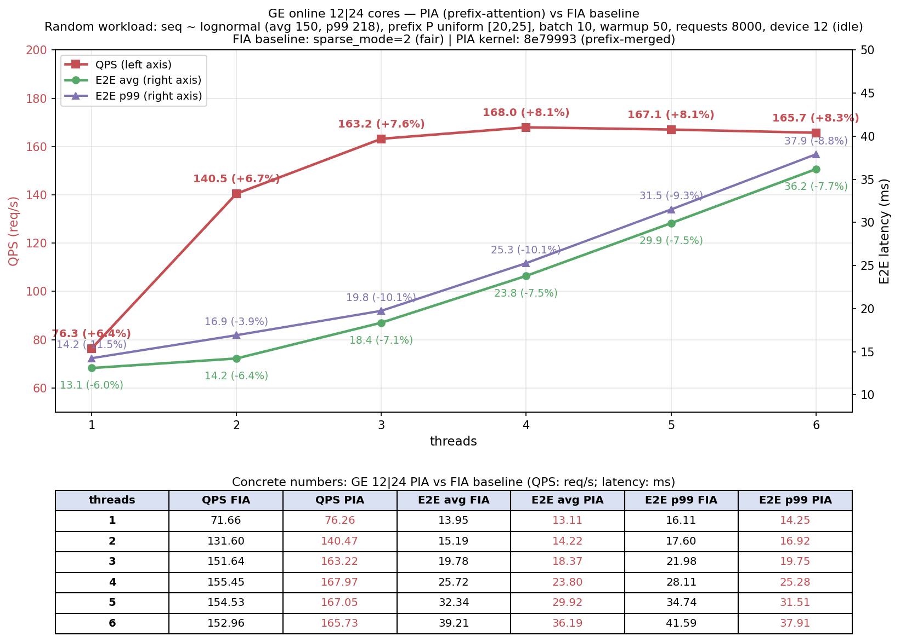

# Qwen2.5-0.5B prefix-attention 接入精度与性能测试报告

> 测试日期: 2026-09-15 (公平基线复测)
> 测试环境: Ascend910_9382 (910_93), CANN 9.0.0, torch 2.9.0 / torch_npu 2.9.0.post2, transformers 5.10.1
> 基线模型: qwen2.5-0.5b (FIA varlen, **sparse_mode=2 公平基线**, 见 3.1)
> 测试模型: qwen2.5-0.5b-prefix (prefix-attention 分支)
> 算子: npu_prefix_infer_attention_score ([prefix-attention 仓库](https://github.com/fengz72/prefix-attention) commit `d6a5a2d`, KV 内嵌版, .run + wheel 安装, 单测 PASS)
> 测试工具: `atb/build/bench_ge_latency` (GESession 在线路径, 12|24 限核)

## 1. 测试背景

### 1.1 prefix-in-Q 接入方式

同一 batch 内 10 条请求共享同一 prefix (system prompt 语义, 长度 P 运行时可变,
测试用 [20,25] 随机)。整层输入打包为 `[prefix(P), req0, req1, ...]` 穿过全部层
(RMSNorm/MLP/Embedding 逐 token 独立 → 数学等价), 每层 attention 调
`npu_prefix_infer_attention_score`:

- **prefix 的 K/V/输出只存一份、只算一份**: q/k/v 均传全长 TND
  `[P+sum(L), N, D]` (prefix KV 内嵌 key/value 头部, 算子内部处理, 无需切分);
  物理 token 每请求省 (batch-1)×P 个
- 切入点在 RoPE 之后 (interface 收到已旋转的 q/k/v), GQA 原生支持
- **图输入 3 个, 与基线 FIA 图同构** (Data 节点顺序):
  `act(arg1_1), input_ids(arg4_1), position_ids(arg7_1)`
- act 契约 (KV 内嵌版算子): `act = cumsum([P, L0, L1, ...])` — prefix 独立成
  batch 0 (P=act[0]), 请求 i 为 batch i+1, act_q ≡ act_kv
- `last_indices = act[1:] - 1` (丢弃 prefix 段结束行, 请求 i 末行 = act[i+1]-1)
- P 只存在于 act 值中 (act 形状固定 [batch+1]) — 换 P/换 shape 不重编译,
  随机负载 shape 组合仅由 T' 决定
- 输出 `[P+sum(L), N, D]` (prefix 段输出在头部), 图取每请求末行 logits

### 1.2 对比口径

基线与 prefix 版喂**同语义负载**: batch 内每条请求 = 共享 prefix + 自有内容。
基线 FIA 逐请求重复展开 prefix (物理 token = sum(P+L_i)); prefix 版 packed 布局
只算一份 (物理 token = P+sum(L_i))。两者输出的每请求最后 token logits 数学等价,
可逐位对比。负载两种: 固定 seq (精度回归) 与随机 seq (性能, 见第 3 章)。

## 2. 精度验证

| 验证项 | 结果 |
|---|---|
| 算子单测 (tests/test_torch_binding.py) | **PASS**: eager vs CPU golden 1.15e-4 (<2e-3), .tensor 与 GE 图模式 bit 级 |
| 固定回归 (P=20, seq=208, batch 10) | prefix 图输出 vs 基线 OM golden **逐位一致** (max_diff=0, cosine=1.0, argmax 10/10) |
| 固定回归 vs eager golden | max_diff=0.1387, cosine=0.99996 (与基线 OM-vs-eager 同水平) |
| 抽验 (P=25 + 随机 seq, T=1286) | vs eager golden cosine=0.99996, argmax 10/10, top5 一致 |
| 基线 sparse_mode 2 vs 3 | 输出**逐位一致** (max_diff=0) — 语义等价, 见 3.1 |
| 稳态 execute (ge_infer, seq=208 固定输入) | 基线 (sm2) 13.92ms / prefix 12.20ms |

## 3. GE 限核 (12|24) 随机负载性能 (device 12, 公平基线)

### 3.1 公平基线 (sparse_mode 修正)

初版基线 FIA 使用 `sparse_mode=3` (rightDownCausal), 在 GE 图编译 (动态 act) 下
选到 **MIX 慢 tiling 分支**: attention kernel 107µs/层, 比单算子 bench 慢约 2 倍
(kernel 二进制相同 `8cd36e66`, tiling key 不同)。改为 `sparse_mode=2` (压缩 causal,
与单算子 bench 口径一致) 后落到纯 AIC 快分支。两者输出逐位一致 (语义等价)。
PIA 在两种环境下 tiling 分支与耗时均一致 (不受影响)。

**算子级对比** (固定 seq=150, P=20, PipeUtilization profiling, 2640 次调用):

| | FIA (sm3, 旧基线) | FIA (sm2, 公平基线) | PIA |
|---|---|---|---|
| tiling 分支 | MIX (24 AIC + 48 AIV) | **纯 AIC** (20 块) | 纯 AIC (21 块) |
| attention kernel/call | 107.0µs | **63.5µs** | 74.7µs |
| 总 kernel 时间/请求 | 11.06ms | 9.91ms | **9.73ms** |

修正后归因: **PIA attention kernel 比公平 FIA 慢 17.6%** (74.7 vs 63.5µs, 与单算子
bench 方向一致: seq=150 时 1.29×, seq=218 时 1.07×)。PIA 的端到端收益全部来自
**算法层 token 节省** — prefix 只算一份使非 attention 算子 (MatMul/Norm 等) 工作量
-12% (1320 vs 1500 token), 足以覆盖 attention kernel 的倒贴并有净盈余。
(两种 attention kernel 均为 scalar+MTE 主导, cube 仅占 3-8%, 非访存/算力瓶颈差异。)

### 3.2 工作负载与条件

| 项 | 值 |
|---|---|
| seq_len | lognormal(4.997, 0.167) clip [1,218] — **avg≈150, p99≈218** (随机) |
| prefix P | 每请求均匀随机 [20, 25] (`--prefix 20-25`) |
| batch / warmup / requests | 10 / 50 / 8000 |
| 线程数 sweep | 1, 2, 3, 4, 5, 6 (独立线程闭环, 每线程独立图实例) |
| 限核 | 12\|24 (AIC\|AIV 1:2), `--aicore-num 12` 经 GEInitialize 注入 |

### 3.3 QPS 与 E2E 延迟 (avg / p99, ms)

| Threads | QPS: FIA 基线 | QPS: PIA | QPS 收益 | E2E avg/p99: FIA 基线 | E2E avg/p99: PIA | E2E 变化 (avg/p99) |
|---|---|---|---|---|---|---|
| 1 | 71.66 | 76.26 | **+6.4%** | 13.95 / 16.11 | 13.11 / 14.25 | -6.0% / -11.5% |
| 2 | 131.60 | 140.47 | **+6.7%** | 15.19 / 17.60 | 14.22 / 16.92 | -6.4% / -3.9% |
| 3 | 151.64 | 163.22 | **+7.6%** | 19.78 / 21.98 | 18.37 / 19.75 | -7.1% / -10.1% |
| 4 | 155.45 | **167.97** | **+8.1%** | 25.72 / 28.11 | 23.80 / 25.28 | -7.5% / -10.1% |
| 5 | 154.53 | 167.05 | **+8.1%** | 32.34 / 34.74 | 29.92 / 31.51 | -7.5% / -9.3% |
| 6 | 152.96 | 165.73 | **+8.4%** | 39.21 / 41.59 | 36.19 / 37.91 | -7.7% / -8.8% |



### 3.5 分析

- **PIA 收益 (公平基线, GE 12|24 随机负载)**: QPS 全档位稳定 **+6.4~8.4%**,
  E2E avg -6.0~7.7%, p99 -4~11%
- **吞吐峰值**: PIA 4T 167.97 QPS (语义 ~218k tok/s); FIA 基线 155.45
- 收益来源是**算法层 token 节省** (prefix 共享一份, 非 attention 算子 -12%),
  而非 attention kernel 更快 (kernel 反而慢 17.6%, 见 3.1) — 若后续 PIA kernel
  优化到 FIA 水平, 端到端收益可再增约 3 个百分点
- 新 kernel `8e79993` (prefix-merged) 与旧 kernel 端到端性能持平 (±1%) —
  kernel 级优化在端到端只占 ~19% 权重, 提升被环境噪声覆盖
- 若以 sm3 旧基线对比, PIA 收益会被放大至 +14~18% — 其中约 6~10 个百分点来自
  基线慢分支 handicap, 本报告以 sm2 公平基线为准

## 4. 关键实现约束 (踩坑记录)

1. **CompileGraph 必须在 aclrtSetDevice 之前** — GE 编译期内部线程先建立 context
   绑定, 之后 SetDevice 的默认 context 才与 GE executor 一致; 否则
   ExecuteGraphWithStreamAsync 报 `stream is not in current ctx`
2. 不可用显式 `aclrtCreateContext` (同因); 工作线程共享默认 context
3. **AICORE_NUM 必须挂 GEInitialize 全局选项** — 挂 AddGraph 图选项时
   CompileGraph 正常但 LoadGraph 报 `GetPlatformInfo failed`;
   `--aicore-num 12` (整数 N → N|2N, AIC|AIV 1:2) 或 "12|24" 原样透传, 与 run.sh atc 一致
4. **基线 FIA 的 sparse_mode 必须=2** — sparse_mode=3 在 GE 图编译下选 MIX 慢
   tiling 分支 (attention ~2×耗时), 输出不变但性能失真 (见 3.1)
5. warmup 需轮流打满所有图 (触发各自 shape 特化)
6. 输入顺序必须与图 Data 节点一致 (GE/ACL 均按 inputs 下标映射, 不校验名字);
   prefix AIR: `act, input_ids, position_ids` (arg1_1/arg4_1/arg7_1)

## 5. 复现路径

```bash
# ---- 算子 (prefix-attention 工程) ----
bash build.sh && bash build_out/custom_opp_openEuler_aarch64.run --quiet \
    --install-path=$ASCEND_HOME_PATH/opp
pip install torch_binding/dist/*.whl
python3 tests/test_torch_binding.py        # 需 PASS

# ---- 基线: FIA (sparse_mode=2 公平基线, 本分支 attention.py 已改; main 分支为 sm3) ----
cd atb/models/qwen2.5-0.5b
./run.sh export --device 12

# ---- prefix ----
./run.sh export --device 12 --prefix 20
PYTHONPATH=<repo> python3 -m model.prepare_air_inputs --device 12 --prefix 20   # 输入+eager golden

# ---- GE 限核 (12|24) 性能 (需 vendor set_env.bash + PYTHONPATH, 见下) ----
export PYTHONPATH=/usr/local/python3.11.15/lib/python3.11/site-packages:$PYTHONPATH
# prefix 命令前: source $ASCEND_HOME_PATH/opp/vendors/custom_prefix_attn/bin/set_env.bash
./build/bench_ge_latency --model air/qwen2.5-0.5b.air --sweep 1,2,3,4,5,6 \
    --requests 8000 --warmup 50 --aicore-num 12 --device-id 12
./build/bench_ge_latency --model air/qwen2.5-0.5b-prefix.air --sweep 1,2,3,4,5,6 \
    --requests 8000 --warmup 50 --prefix 20-25 --aicore-num 12 --device-id 12

# ---- 精度验证 ----
./build/ge_infer --model air/qwen2.5-0.5b-prefix.air --device_id 2 --output_dir <dir> \
    --input "arg1_1:11:int64:ND:input_data_prefix/act.bin" \
    --input "arg4_1:1900:int64:ND:input_data_prefix/input_ids.bin" \
    --input "arg7_1:1900:int64:ND:input_data_prefix/position_ids.bin"   # vs golden 对比

# ---- 算子级 profiling (PipeUtilization) ----
./build/bench_ge_latency --model air/<m>.air --threads 1 --requests 100 --warmup 10 \
    --fixed-seq 150 [--prefix 20] --device-id 12 \
    --profiling --profiling_output profiling_data/<tag>
python3 tools/parse_profiling.py parse-and-export --profiling_dir profiling_data/<tag>
# attention pipeline 指标在 mindstudio_profiler_output/op_summary_*.csv
# (aic_mac/scalar/mte1/mte2/fixpipe, aiv_vec/scalar/mte2/mte3)
```

原始日志 (GE 12|24 随机负载, 公平基线, device 12 复测):
`/tmp/opencode/d12_sm2_ge_prefix_12c_r2.log` (PIA),
`/tmp/opencode/d12_fia_bg.log` (FIA sweep) + `/tmp/opencode/d12_fia_4t.log` (FIA 4T 段复测);
算子级 profiling: `atb/profiling_data/ge_fia_sm2|ge_fia_pipe|ge_pia_pipe`,
单算子对照 `/export/home/weinan5/hejun/workspace/prefix_attn_ws/prof_pia_fia_20260915/`
